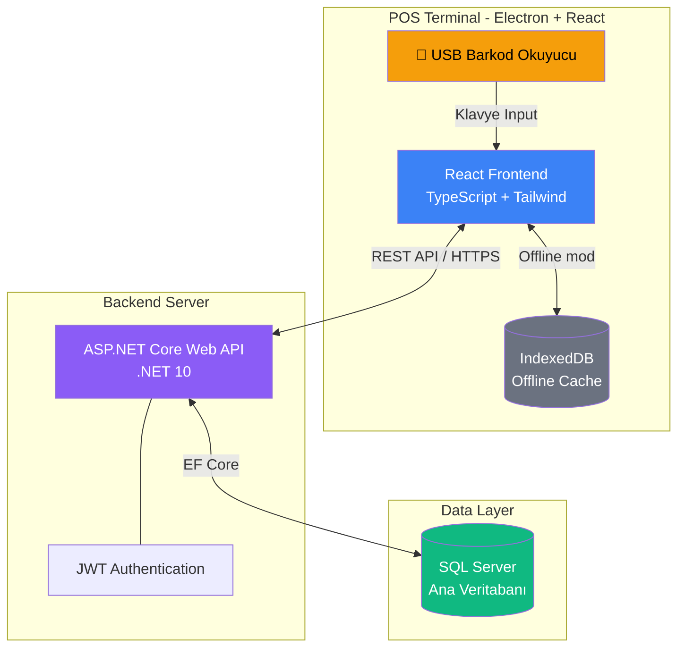
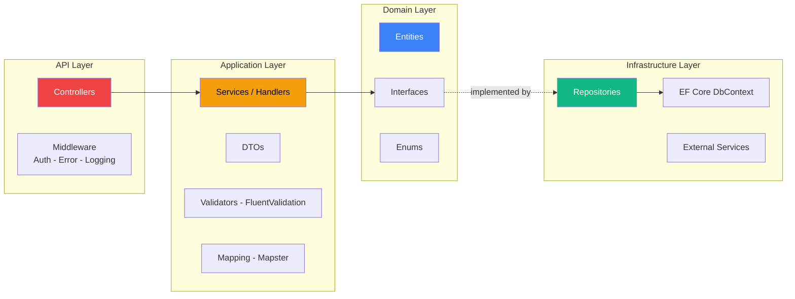
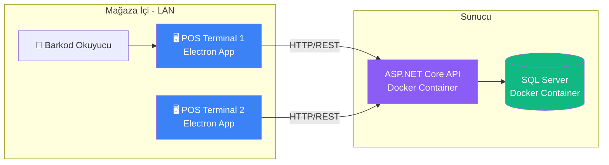
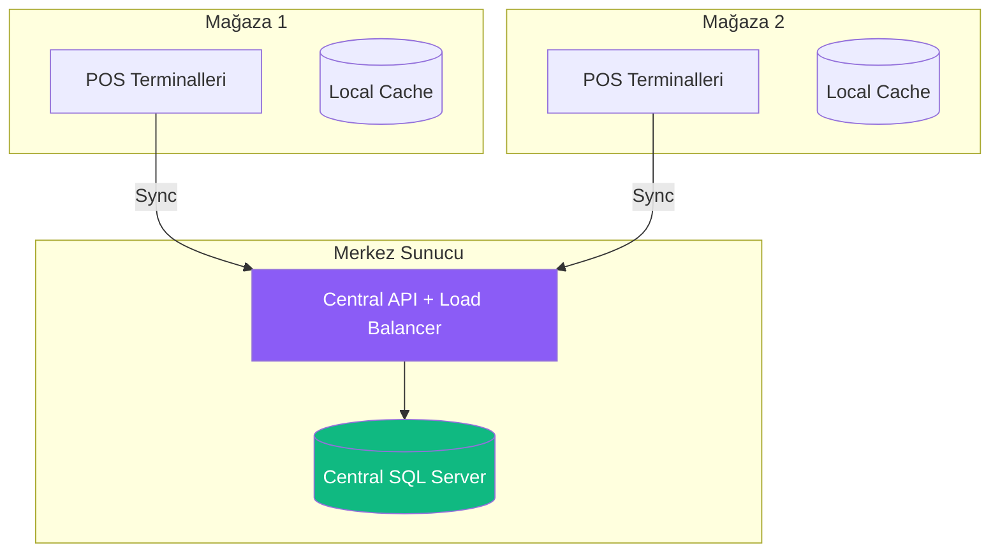

# 🏗️ Sistem Mimarisi

## Genel Mimari Diyagramı



---

## Katmanlı Mimari (Clean Architecture)



### Bağımlılık Kuralı

```
API → Application → Domain ← Infrastructure
```

- **Domain** hiçbir katmana bağımlı değildir (saf entity ve interface)
- **Application** sadece Domain'e bağımlıdır
- **Infrastructure** Domain interface'lerini implement eder
- **API** her şeyi DI ile birleştirir

---

## Proje Klasör Yapısı

```
/barcode-pos-system
│
├── /src
│   ├── /backend
│   │   ├── BarcodePos.sln
│   │   ├── /src
│   │   │   ├── /BarcodePos.Domain            # Entity + Interface
│   │   │   ├── /BarcodePos.Application        # Services, DTOs, Validators
│   │   │   ├── /BarcodePos.Infrastructure     # EF Core, Repositories
│   │   │   └── /BarcodePos.API                # Controllers, Middleware
│   │   └── /tests
│   │       ├── /BarcodePos.UnitTests
│   │       └── /BarcodePos.IntegrationTests
│   │
│   └── /frontend
│       ├── package.json
│       ├── /public
│       ├── /src
│       │   ├── /components
│       │   │   ├── /pos                       # Satış ekranı bileşenleri
│       │   │   ├── /admin                     # Admin panel bileşenleri
│       │   │   └── /shared                    # Ortak bileşenler
│       │   ├── /pages
│       │   │   ├── /pos                       # POS sayfaları
│       │   │   └── /admin                     # Admin sayfaları
│       │   ├── /hooks                         # Custom hooks (useBarcodeScanner)
│       │   ├── /services                      # API istemcileri (axios)
│       │   ├── /store                         # Zustand state management
│       │   ├── /types                         # TypeScript tipleri
│       │   ├── /utils                         # Yardımcı fonksiyonlar
│       │   └── /offline                       # Offline sync modülü
│       └── /electron                          # Electron shell yapılandırması
│
├── /database
│   ├── /migrations                            # EF Core migrations
│   └── /seed                                  # Başlangıç verileri
│
├── /docs                                      # Mimari dokümanlar
├── docker-compose.yml
└── README.md
```

---

## Deployment Mimarisi



### Docker Compose

```yaml
# docker-compose.yml
services:
  api:
    build: ./src/backend
    ports:
      - "5000:8080"
    environment:
      - ConnectionStrings__Default=Server=db;Database=BarcodePos;User=sa;Password=${DB_PASSWORD};TrustServerCertificate=true
      - Jwt__Secret=${JWT_SECRET}
    depends_on:
      - db
    restart: unless-stopped

  db:
    image: mcr.microsoft.com/mssql/server:2022-latest
    ports:
      - "1433:1433"
    environment:
      - ACCEPT_EULA=Y
      - SA_PASSWORD=${DB_PASSWORD}
    volumes:
      - sqldata:/var/opt/mssql
    restart: unless-stopped

volumes:
  sqldata:
```

---

## Çoklu Mağaza Ölçeklendirme (Gelecek Faz)



| Strateji | Açıklama |
|----------|----------|
| **StoreId filtreleme** | Tüm sorgular `StoreId` ile filtrelenir, tek DB'de çoklu mağaza |
| **Tenant isolation** | Her mağaza kendi verisini görür, API middleware ile zorunlu |
| **Offline-first sync** | Her mağaza local çalışır, merkeze periyodik senkronize eder |
| **Horizontal scaling** | API katmanı Docker ile çoğaltılır, load balancer arkasında |
