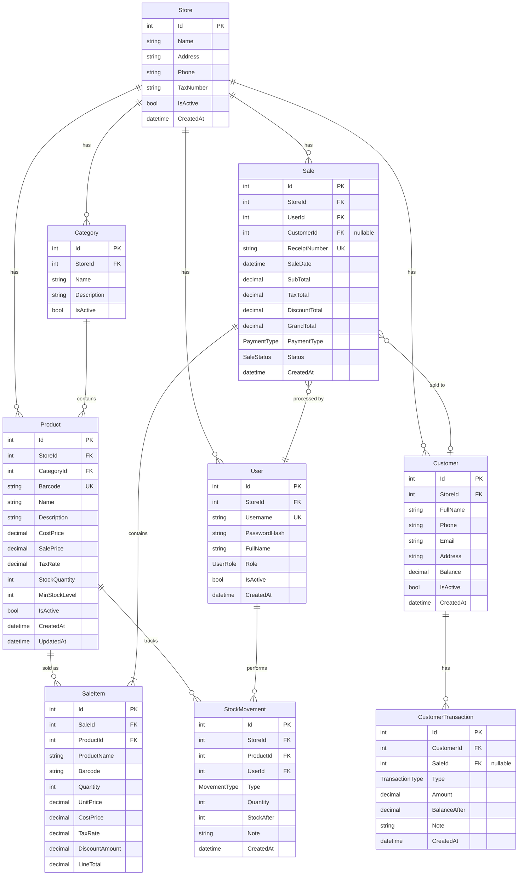

# 💾 Veritabanı Tasarımı

## ER Diyagramı



---

## Entity Sınıfları

### Product

```csharp
namespace BarcodePos.Domain.Entities;

public class Product
{
    public int Id { get; set; }
    public int StoreId { get; set; }
    public int CategoryId { get; set; }
    public string Barcode { get; set; } = string.Empty;
    public string Name { get; set; } = string.Empty;
    public string? Description { get; set; }
    public decimal CostPrice { get; set; }      // Alış fiyatı (kâr/zarar raporu için)
    public decimal SalePrice { get; set; }       // Satış fiyatı
    public decimal TaxRate { get; set; }         // KDV oranı
    public int StockQuantity { get; set; }
    public int MinStockLevel { get; set; }       // Minimum stok uyarı seviyesi
    public bool IsActive { get; set; } = true;
    public DateTime CreatedAt { get; set; }
    public DateTime? UpdatedAt { get; set; }

    // Navigation
    public Store Store { get; set; } = null!;
    public Category Category { get; set; } = null!;
    public ICollection<SaleItem> SaleItems { get; set; } = [];
    public ICollection<StockMovement> StockMovements { get; set; } = [];
}
```

### Sale

```csharp
namespace BarcodePos.Domain.Entities;

public class Sale
{
    public int Id { get; set; }
    public int StoreId { get; set; }
    public int UserId { get; set; }             // Kasiyerin Id'si
    public int? CustomerId { get; set; }        // Null = anonim satış
    public string ReceiptNumber { get; set; } = string.Empty;
    public DateTime SaleDate { get; set; }
    public decimal SubTotal { get; set; }
    public decimal TaxTotal { get; set; }
    public decimal DiscountTotal { get; set; }
    public decimal GrandTotal { get; set; }
    public PaymentType PaymentType { get; set; } // Nakit, Kart, Veresiye
    public SaleStatus Status { get; set; }       // Tamamlandı, İptal, İade
    public DateTime CreatedAt { get; set; }

    // Navigation
    public Store Store { get; set; } = null!;
    public User User { get; set; } = null!;
    public Customer? Customer { get; set; }
    public ICollection<SaleItem> Items { get; set; } = [];
}
```

### SaleItem

```csharp
namespace BarcodePos.Domain.Entities;

public class SaleItem
{
    public int Id { get; set; }
    public int SaleId { get; set; }
    public int ProductId { get; set; }
    public string ProductName { get; set; } = string.Empty;  // Satış anındaki isim
    public string Barcode { get; set; } = string.Empty;
    public int Quantity { get; set; }
    public decimal UnitPrice { get; set; }       // Satış anındaki birim fiyat
    public decimal CostPrice { get; set; }       // Satış anındaki alış fiyatı
    public decimal TaxRate { get; set; }
    public decimal DiscountAmount { get; set; }
    public decimal LineTotal { get; set; }

    // Navigation
    public Sale Sale { get; set; } = null!;
    public Product Product { get; set; } = null!;
}
```

### Customer

```csharp
namespace BarcodePos.Domain.Entities;

public class Customer
{
    public int Id { get; set; }
    public int StoreId { get; set; }
    public string FullName { get; set; } = string.Empty;
    public string? Phone { get; set; }
    public string? Email { get; set; }
    public string? Address { get; set; }
    public decimal Balance { get; set; }         // Veresiye bakiyesi (+ = borçlu)
    public bool IsActive { get; set; } = true;
    public DateTime CreatedAt { get; set; }

    // Navigation
    public Store Store { get; set; } = null!;
    public ICollection<Sale> Sales { get; set; } = [];
    public ICollection<CustomerTransaction> Transactions { get; set; } = [];
}
```

### CustomerTransaction

```csharp
namespace BarcodePos.Domain.Entities;

public class CustomerTransaction
{
    public int Id { get; set; }
    public int CustomerId { get; set; }
    public int? SaleId { get; set; }
    public TransactionType Type { get; set; }    // Borç (veresiye satış), Ödeme
    public decimal Amount { get; set; }
    public decimal BalanceAfter { get; set; }
    public string? Note { get; set; }
    public DateTime CreatedAt { get; set; }

    // Navigation
    public Customer Customer { get; set; } = null!;
    public Sale? Sale { get; set; }
}
```

### StockMovement

```csharp
namespace BarcodePos.Domain.Entities;

public class StockMovement
{
    public int Id { get; set; }
    public int StoreId { get; set; }
    public int ProductId { get; set; }
    public int UserId { get; set; }
    public MovementType Type { get; set; }       // Giriş, Çıkış, Satış, İade, Düzeltme
    public int Quantity { get; set; }            // + giriş, - çıkış
    public int StockAfter { get; set; }          // Hareket sonrası stok
    public string? Note { get; set; }
    public DateTime CreatedAt { get; set; }

    // Navigation
    public Product Product { get; set; } = null!;
    public User User { get; set; } = null!;
}
```

### User

```csharp
namespace BarcodePos.Domain.Entities;

public class User
{
    public int Id { get; set; }
    public int StoreId { get; set; }
    public string Username { get; set; } = string.Empty;
    public string PasswordHash { get; set; } = string.Empty;
    public string FullName { get; set; } = string.Empty;
    public UserRole Role { get; set; }           // Admin, Yönetici, Kasiyer
    public bool IsActive { get; set; } = true;
    public DateTime CreatedAt { get; set; }

    // Navigation
    public Store Store { get; set; } = null!;
    public ICollection<Sale> Sales { get; set; } = [];
}
```

### Category

```csharp
namespace BarcodePos.Domain.Entities;

public class Category
{
    public int Id { get; set; }
    public int StoreId { get; set; }
    public string Name { get; set; } = string.Empty;
    public string? Description { get; set; }
    public bool IsActive { get; set; } = true;

    // Navigation
    public Store Store { get; set; } = null!;
    public ICollection<Product> Products { get; set; } = [];
}
```

### Store

```csharp
namespace BarcodePos.Domain.Entities;

public class Store
{
    public int Id { get; set; }
    public string Name { get; set; } = string.Empty;
    public string? Address { get; set; }
    public string? Phone { get; set; }
    public string? TaxNumber { get; set; }
    public bool IsActive { get; set; } = true;
    public DateTime CreatedAt { get; set; }
}
```

### Enums

```csharp
namespace BarcodePos.Domain.Entities;

public enum PaymentType
{
    Nakit = 1,
    Kart = 2,
    Veresiye = 3
}

public enum SaleStatus
{
    Tamamlandi = 1,
    Iptal = 2,
    Iade = 3
}

public enum UserRole
{
    Admin = 1,
    Yonetici = 2,
    Kasiyer = 3
}

public enum MovementType
{
    Giris = 1,
    Cikis = 2,
    Satis = 3,
    Iade = 4,
    Duzeltme = 5
}

public enum TransactionType
{
    Borc = 1,      // Veresiye satış → müşteri borçlanır
    Odeme = 2      // Müşteri ödeme yapar
}
```

---

## Önemli Index'ler

| Tablo | Index | Tip | Açıklama |
|-------|-------|-----|----------|
| Products | `StoreId + Barcode` | Unique | Barkodla hızlı arama |
| Sales | `ReceiptNumber` | Unique | Fiş numarası tekil |
| Sales | `StoreId + SaleDate` | Non-unique | Tarihsel sorgulama |
| Users | `Username` | Unique | Giriş kontrolü |
| StockMovements | `ProductId + CreatedAt` | Non-unique | Stok geçmişi |

---

## Decimal Precision

| Alan | Precision | Açıklama |
|------|-----------|----------|
| Fiyatlar (CostPrice, SalePrice, UnitPrice) | `decimal(18,2)` | Para birimi |
| KDV Oranı (TaxRate) | `decimal(5,2)` | Yüzde değeri |
| Bakiye (Balance) | `decimal(18,2)` | Cari hesap |
