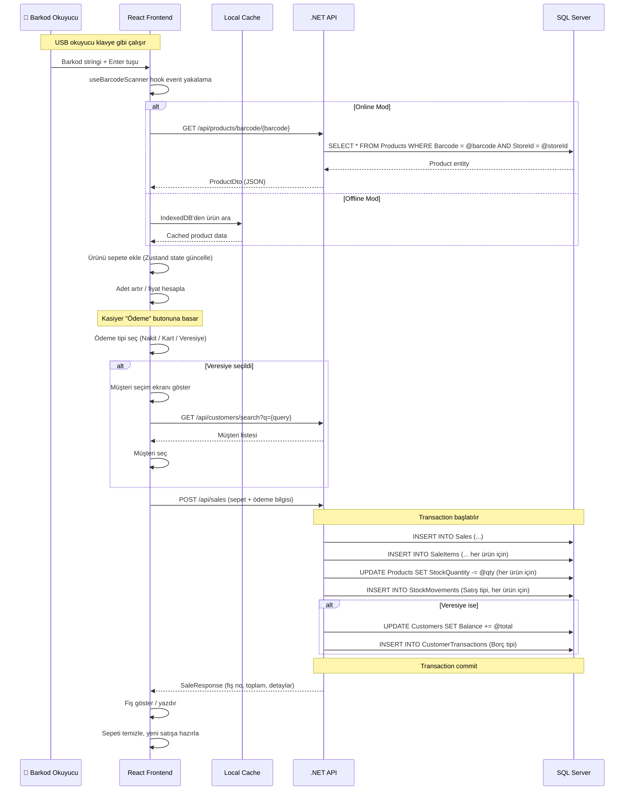

# 🛒 POS Satış Ekranı Akış Mantığı

## Ana Satış Akışı



---

## Barkod Okuyucu Hook'u (useBarcodeScanner)

USB barkod okuyucu klavye gibi davranır — karakterleri çok hızlı art arda basar ve sonunda Enter gönderir.

### Ayrıştırma Mantığı

```
Normal klavye: tuşlar arası > 100ms
Barkod okuyucu: tuşlar arası < 30ms

Filtre: maxDelay = 50ms
→ 50ms içinde peş peşe gelen karakterler = barkod
→ Enter gelince → onScan tetiklenir
```

### Hook Kodu

```typescript
import { useEffect, useRef, useCallback } from 'react';

interface UseBarcodeOptions {
  onScan: (barcode: string) => void;
  minLength?: number;    // Minimum barkod uzunluğu
  maxDelay?: number;     // Tuşlar arası max süre (ms)
}

export function useBarcodeScanner({
  onScan,
  minLength = 4,
  maxDelay = 50
}: UseBarcodeOptions) {
  const bufferRef = useRef('');
  const lastKeyTimeRef = useRef(0);

  const handleKeyDown = useCallback((e: KeyboardEvent) => {
    const now = Date.now();

    // Tuşlar arası süre çok uzunsa → manuel klavye, buffer sıfırla
    if (now - lastKeyTimeRef.current > maxDelay) {
      bufferRef.current = '';
    }
    lastKeyTimeRef.current = now;

    if (e.key === 'Enter') {
      const barcode = bufferRef.current.trim();
      if (barcode.length >= minLength) {
        e.preventDefault();
        onScan(barcode);
      }
      bufferRef.current = '';
      return;
    }

    // Sadece yazdırılabilir karakterleri buffer'a ekle
    if (e.key.length === 1) {
      bufferRef.current += e.key;
    }
  }, [onScan, minLength, maxDelay]);

  useEffect(() => {
    window.addEventListener('keydown', handleKeyDown);
    return () => window.removeEventListener('keydown', handleKeyDown);
  }, [handleKeyDown]);
}
```

---

## Satış Ekranı UI Düzeni

```
┌─────────────────────────────────────────────────────────────┐
│  [Logo]  BARCODE POS          Kasiyer: Ahmet    [Çıkış]    │
├──────────────────────────────────┬──────────────────────────┤
│                                  │                          │
│  🔍 Barkod / Ürün Ara...        │    SEPET                 │
│  ─────────────────────────       │    ──────────────────    │
│                                  │                          │
│  Son eklenen:                    │    1. Coca Cola 1L       │
│  ┌─────────────────────────┐     │       2 x ₺15.00 = ₺30  │
│  │  Coca Cola 1L           │     │                          │
│  │  Barkod: 869000001      │     │    2. Ülker Çikolata     │
│  │  Fiyat: ₺15.00          │     │       1 x ₺15.50 = ₺16  │
│  │  Stok: 45               │     │                          │
│  └─────────────────────────┘     │    ──────────────────    │
│                                  │    Ara Toplam:  ₺45.50   │
│                                  │    KDV:         ₺8.19    │
│                                  │    İndirim:    -₺1.50    │
│                                  │    ──────────────────    │
│                                  │    TOPLAM:     ₺52.19    │
│                                  │                          │
│                                  │    [NAKİT]  [KART]      │
│                                  │    [VERESİYE]            │
│                                  │                          │
│                                  │    [🗑️ Sepeti Temizle]   │
├──────────────────────────────────┴──────────────────────────┤
│  F1:Ürün Ara  F2:Müşteri  F3:Son Satışlar  F4:Gün Sonu    │
└─────────────────────────────────────────────────────────────┘
```

---

## Sepet State Yönetimi (Zustand)

```typescript
interface CartItem {
  productId: number;
  barcode: string;
  name: string;
  quantity: number;
  unitPrice: number;
  taxRate: number;
  discountAmount: number;
  lineTotal: number;
}

interface CartState {
  items: CartItem[];
  customerId: number | null;
  paymentType: PaymentType | null;

  // Actions
  addItem: (product: ProductDto) => void;
  removeItem: (productId: number) => void;
  updateQuantity: (productId: number, quantity: number) => void;
  setDiscount: (productId: number, discount: number) => void;
  setCustomer: (customerId: number | null) => void;
  setPaymentType: (type: PaymentType) => void;
  clearCart: () => void;

  // Computed
  subTotal: () => number;
  taxTotal: () => number;
  discountTotal: () => number;
  grandTotal: () => number;
}
```

---

## Klavye Kısayolları

| Kısayol | İşlem |
|---------|-------|
| **Barkod + Enter** | Ürün ekle |
| **F1** | Manuel ürün arama |
| **F2** | Müşteri seçimi |
| **F3** | Son satışları göster |
| **F4** | Gün sonu raporu |
| **F8** | Nakit ödeme |
| **F9** | Kart ödeme |
| **F10** | Veresiye ödeme |
| **Esc** | Sepeti temizle (onay ile) |
| **Delete** | Seçili ürünü sil |
| **+/-** | Adet artır/azalt |
