# 📊 Admin Panel & UI Sayfaları

## Admin Dashboard Modülleri

```mermaid
graph TB
    subgraph "Admin Dashboard"
        direction TB
        DS[📊 Dashboard Ana Sayfa]
        PM[📦 Ürün Yönetimi]
        SM[📊 Stok Yönetimi]
        SR[📈 Satış Raporları]
        CM[👥 Müşteri Yönetimi]
        UM[👤 Kullanıcı Yönetimi]
        ST[⚙️ Ayarlar]
    end

    PM --> PM1[Ürün CRUD]
    PM --> PM2[Kategori CRUD]
    PM --> PM3[Barkod Atama]
    PM --> PM4[Toplu Ürün Import]

    SM --> SM1[Stok Giriş / Çıkış]
    SM --> SM2[Stok Hareketleri Listesi]
    SM --> SM3[Düşük Stok Uyarıları]
    SM --> SM4[Stok Sayım]

    SR --> SR1[Günlük / Haftalık / Aylık]
    SR --> SR2[En Çok Satan Ürünler]
    SR --> SR3[Ödeme Tipine Göre]
    SR --> SR4[Kâr / Zarar Raporu]
    SR --> SR5[Excel Export]

    CM --> CM1[Müşteri CRUD]
    CM --> CM2[Veresiye Bakiye Takibi]
    CM --> CM3[Tahsilat Kayıt]

    UM --> UM1[Kullanıcı CRUD]
    UM --> UM2[Rol Atama]

    style DS fill:#3b82f6,color:#fff
    style PM fill:#3b82f6,color:#fff
    style SM fill:#f59e0b,color:#000
    style SR fill:#10b981,color:#fff
    style CM fill:#8b5cf6,color:#fff
    style UM fill:#ef4444,color:#fff
    style ST fill:#6b7280,color:#fff
```



---

## Tüm UI Sayfaları

### Ortak Sayfalar

| Sayfa | Route | Açıklama |
|-------|-------|----------|
| Giriş | `/login` | Kullanıcı adı + şifre |
| 404 | `/*` | Sayfa bulunamadı |

### POS Ekranları (Kasiyer)

| Sayfa | Route | Açıklama |
|-------|-------|----------|
| **Satış Ekranı** | `/pos` | Ana ekran — barkod tarama, sepet, ödeme |
| **Müşteri Seçimi** | `/pos` (modal) | Veresiye satış için müşteri arama/seçim |
| **Satış Geçmişi** | `/pos/history` | Kasiyerin kendi günlük satışları |
| **Gün Sonu** | `/pos/end-of-day` | Günlük kasa raporu özeti |

### Admin Panel Sayfaları

| Sayfa | Route | Yetki | Açıklama |
|-------|-------|-------|----------|
| **Dashboard** | `/admin` | Yönetici+ | Günlük satış kartları, grafikler, düşük stok uyarıları |
| **Ürün Listesi** | `/admin/products` | Yönetici+ | Arama, filtreleme, sayfalama |
| **Ürün Ekle/Düzenle** | `/admin/products/new` `/admin/products/:id/edit` | Yönetici+ | Ürün formu (barkod, fiyat, kategori, stok) |
| **Kategori Yönetimi** | `/admin/categories` | Yönetici+ | Kategori CRUD |
| **Stok Giriş/Çıkış** | `/admin/stock/movement` | Yönetici+ | Manuel stok hareketi kayıt formu |
| **Stok Hareketleri** | `/admin/stock/history` | Yönetici+ | Hareket logları (filtrelenebilir) |
| **Düşük Stok Uyarıları** | `/admin/stock/alerts` | Yönetici+ | MinStockLevel altındaki ürünler listesi |
| **Satış Listesi** | `/admin/sales` | Yönetici+ | Tüm satışlar (tarih filtreli) |
| **Satış Detay** | `/admin/sales/:id` | Yönetici+ | Tek satışın fiş görünümü |
| **Satış Raporu** | `/admin/reports/sales` | Yönetici+ | Günlük/haftalık/aylık grafikler + tablo |
| **Kâr/Zarar Raporu** | `/admin/reports/profit` | Admin | Dönemsel kârlılık analizi |
| **En Çok Satanlar** | `/admin/reports/top-products` | Yönetici+ | Ürün bazlı satış sıralaması |
| **Ödeme Dağılımı** | `/admin/reports/payments` | Yönetici+ | Nakit/Kart/Veresiye dağılımı |
| **Müşteri Listesi** | `/admin/customers` | Yönetici+ | Müşteri CRUD |
| **Müşteri Detay** | `/admin/customers/:id` | Yönetici+ | Bakiye, işlem geçmişi |
| **Veresiye Takip** | `/admin/customers/balances` | Yönetici+ | Tüm müşterilerin bakiyeleri |
| **Tahsilat Kayıt** | `/admin/customers/:id/payment` (modal) | Yönetici+ | Veresiye ödeme kaydı |
| **Kullanıcı Listesi** | `/admin/users` | Admin | Kullanıcı CRUD |
| **Kullanıcı Ekle/Düzenle** | `/admin/users/new` `/admin/users/:id/edit` | Admin | Kullanıcı formu + rol atama |
| **Mağaza Ayarları** | `/admin/settings` | Admin | Mağaza bilgileri, fiş ayarları |

---

## Dashboard Özet Kartları

```
┌──────────────┐  ┌──────────────┐  ┌──────────────┐  ┌──────────────┐
│  💰 Bugünkü  │  │  🧾 Satış    │  │  ⚠️ Düşük   │  │  💳 Veresiye │
│  Toplam      │  │  Adedi       │  │  Stok        │  │  Bakiye      │
│              │  │              │  │              │  │              │
│  ₺12,450.00  │  │     47       │  │     12       │  │  ₺3,200.00  │
│  ▲ %8 dün   │  │  ▲ %12 dün  │  │  ürün        │  │  toplam borç │
└──────────────┘  └──────────────┘  └──────────────┘  └──────────────┘

┌─────────────────────────────────┐  ┌─────────────────────────────────┐
│  📈 Haftalık Satış Grafiği      │  │  🏆 En Çok Satan Ürünler       │
│                                  │  │                                 │
│  ₺15k ┤        ██               │  │  1. Coca Cola 1L      → 142    │
│  ₺12k ┤     ██ ██ ██            │  │  2. Ekmek             → 98     │
│  ₺10k ┤  ██ ██ ██ ██ ██         │  │  3. Süt 1L            → 87     │
│   ₺8k ┤  ██ ██ ██ ██ ██ ██      │  │  4. Ülker Çikolata    → 65     │
│        Pzt Sal Çar Per Cum Cmt   │  │  5. Su 0.5L           → 53     │
└─────────────────────────────────┘  └─────────────────────────────────┘
```

---

## Sayfa Bazlı Yetki Erişimi

| Sayfa Grubu | Admin | Yönetici | Kasiyer |
|-------------|:-----:|:--------:|:-------:|
| POS Satış Ekranı | ✅ | ✅ | ✅ |
| Dashboard | ✅ | ✅ | ❌ |
| Ürün Yönetimi | ✅ | ✅ | ❌ |
| Stok Yönetimi | ✅ | ✅ | ❌ |
| Satış Raporları | ✅ | ✅ | ❌ |
| Kâr/Zarar Raporu | ✅ | ❌ | ❌ |
| Müşteri Yönetimi | ✅ | ✅ | ❌ |
| Müşteri Arama (satışta) | ✅ | ✅ | ✅ |
| Kullanıcı Yönetimi | ✅ | ❌ | ❌ |
| Ayarlar | ✅ | ❌ | ❌ |
