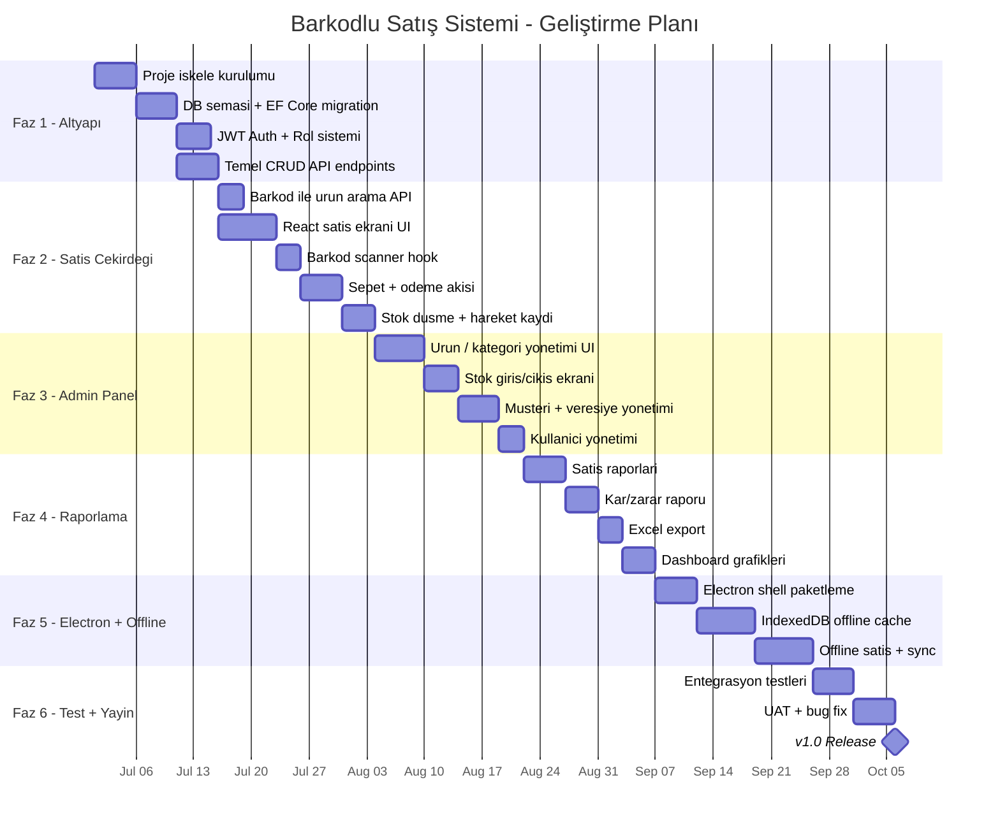

# 🗓️ Geliştirme Yol Haritası

## Genel Bakış

---

## Faz Detayları

### Faz 1 — Altyapı (~3 hafta)

**Hedef:** Projenin temelini oluşturmak

| Görev | Detay | Çıktı |
|-------|-------|-------|
| Proje iskele kurulumu | Solution + 4 katman projesi oluştur | `.sln` + proje dosyaları |
| Docker Compose | SQL Server + API container tanımı | `docker-compose.yml` |
| Domain entity'leri | Tüm entity ve enum sınıfları | Domain katmanı |
| EF Core DbContext | DbContext + OnModelCreating konfigürasyonu | Infrastructure katmanı |
| İlk migration | `InitialCreate` migration | `/migrations` |
| Seed data | Varsayılan mağaza + admin kullanıcı | Başlangıç verisi |
| JWT Authentication | Login endpoint, token üretimi | Auth altyapısı |
| Rol bazlı yetkilendirme | `[Authorize(Roles = "Admin")]` middleware | Yetki sistemi |
| Temel CRUD | Product, Category, Customer, User CRUD endpoint'leri | API katmanı |
| Global error handling | Exception middleware + standart hata formatı | Middleware |

**Faz 1 Tamamlanınca:**
- API çalışır, Swagger'dan test edilebilir
- Login olunabilir, token alınabilir
- Ürün/kategori CRUD çalışır

---

### Faz 2 — Satış Çekirdeği (~3 hafta)

**Hedef:** Barkodla satış yapılabilir hale getirmek

| Görev | Detay | Çıktı |
|-------|-------|-------|
| Barkod arama API | `GET /api/products/barcode/{barcode}` | Hızlı barkod sorgusu |
| React proje kurulumu | Vite + React + TypeScript + Tailwind + React Router | Frontend iskelesi |
| Login sayfası | JWT login formu | Auth UI |
| POS satış ekranı | Sol: ürün bilgisi, Sağ: sepet | Ana satış arayüzü |
| useBarcodeScanner hook | USB okuyucu event yakalama | Barkod hook'u |
| Sepet state (Zustand) | Ürün ekle/çıkar, adet, indirim | State management |
| Ödeme akışı | Nakit/Kart/Veresiye seçimi | Ödeme UI |
| POST /api/sales | Satış oluşturma + stok düşme + transaction | Satış API |
| Fiş görüntüleme | Satış sonrası fiş ekranı | Fiş UI |

**Faz 2 Tamamlanınca:**
- Barkod okutup satış yapılabilir
- Stok otomatik düşer
- Fiş numarası üretilir

---

### Faz 3 — Admin Panel (~3 hafta)

**Hedef:** Yönetim arayüzü tamamlanır

| Görev | Detay | Çıktı |
|-------|-------|-------|
| Admin layout | Sidebar + header + route yapısı | Admin shell |
| Ürün listesi | Tablo, arama, filtreleme, sayfalama | Ürün yönetimi |
| Ürün formu | Ekleme/düzenleme formu (barkod, fiyat, stok) | Ürün CRUD UI |
| Kategori yönetimi | Kategori CRUD sayfası | Kategori UI |
| Stok giriş/çıkış | Manuel hareket kayıt formu | Stok hareketi UI |
| Stok hareketleri | Filtrelenebilir hareket listesi | Stok log UI |
| Düşük stok uyarıları | MinStockLevel altındaki ürünler | Uyarı sayfası |
| Müşteri yönetimi | Müşteri CRUD + bakiye görüntüleme | Müşteri UI |
| Veresiye takip | Bakiye listesi + tahsilat kayıt | Veresiye UI |
| Kullanıcı yönetimi | Kullanıcı CRUD + rol atama | Kullanıcı UI |

**Faz 3 Tamamlanınca:**
- Tüm yönetim işlemleri UI'dan yapılabilir
- Veresiye sistemi çalışır

---

### Faz 4 — Raporlama (~2.5 hafta)

**Hedef:** Tüm raporlar ve export

| Görev | Detay | Çıktı |
|-------|-------|-------|
| Günlük satış raporu | Tarih seçimli satış özeti | Rapor sayfası |
| Dönemsel rapor | Haftalık/aylık satış trendi | Grafik + tablo |
| En çok satan ürünler | Dönemsel sıralama | Top N raporu |
| Ödeme tipi dağılımı | Nakit/Kart/Veresiye pasta grafik | Dağılım raporu |
| Kâr/zarar raporu | Alış-satış farkı analizi (Admin only) | Kârlılık raporu |
| Excel export | ClosedXML ile .xlsx üretimi | Download endpoint |
| Dashboard | Özet kartlar + günlük grafik + uyarılar | Ana sayfa |

**Faz 4 Tamamlanınca:**
- Yönetici tüm raporları görebilir
- Excel export çalışır
- Dashboard anlamlı özet sunar

---

### Faz 5 — Electron + Offline (~3 hafta)

**Hedef:** Masaüstü uygulaması + offline destek

| Görev | Detay | Çıktı |
|-------|-------|-------|
| Electron shell | React app'i Electron içine paketleme | Windows .exe |
| Auto-updater | Uygulama güncelleme mekanizması | Update sistemi |
| IndexedDB cache | Dexie.js ile ürün verisi local cache | Offline DB |
| Offline ürün arama | Network yoksa IndexedDB'den arama | Offline barkod |
| Offline satış kayıt | Satışları local'de sakla | Offline queue |
| Online sync | Bağlantı gelince satışları sunucuya gönder | Sync mekanizması |
| Conflict resolution | Stok çakışması çözümü | Sync güvenliği |

**Faz 5 Tamamlanınca:**
- Windows masaüstü uygulaması kurulabilir
- İnternet kesilse satış devam eder
- Bağlantı gelince otomatik senkronize olur

---

### Faz 6 — Test & Yayın (~2 hafta)

**Hedef:** v1.0 production-ready

| Görev | Detay | Çıktı |
|-------|-------|-------|
| Unit testler | Service ve handler testleri | xUnit testleri |
| Integration testler | API endpoint testleri (Testcontainers) | Entegrasyon testleri |
| E2E testler | Satış akışı uçtan uca test | Playwright testleri |
| Performance test | Barkod arama hızı, satış oluşturma süresi | Performans raporu |
| Security review | JWT, input validation, SQL injection kontrolü | Güvenlik raporu |
| UAT | Gerçek kullanıcıyla test | Bug listesi |
| Bug fix | UAT'ta bulunan hataların düzeltilmesi | Stabil sürüm |
| Dokümantasyon | Kurulum kılavuzu, kullanıcı kılavuzu | `/docs` |
| v1.0 Release | Electron installer + Docker image | **RELEASE** |

---

## Zaman Özeti

| Faz | Süre | Kümülatif | Çıktı |
|-----|------|-----------|-------|
| **Faz 1** — Altyapı | ~3 hafta | 3 hafta | Auth, DB, temel API |
| **Faz 2** — Satış Çekirdeği | ~3 hafta | 6 hafta | Çalışan satış ekranı |
| **Faz 3** — Admin Panel | ~3 hafta | 9 hafta | Tam yönetim paneli |
| **Faz 4** — Raporlama | ~2.5 hafta | 11.5 hafta | Tüm raporlar + Excel |
| **Faz 5** — Electron + Offline | ~3 hafta | 14.5 hafta | Masaüstü + offline |
| **Faz 6** — Test + Yayın | ~2 hafta | **16.5 hafta** | **v1.0 Release** |

---

## Öncelik Sırası (MVP)

Eğer hızlı bir MVP istenirse, minimum çalışan ürün için sıralama:

1. ✅ **Faz 1** — Altyapı (zorunlu)
2. ✅ **Faz 2** — Satış çekirdeği (zorunlu — bu olmadan sistem çalışmaz)
3. ✅ **Faz 3** — Admin panel (zorunlu — ürün eklemek lazım)
4. ⏳ **Faz 4** — Raporlama (MVP sonrası eklenebilir)
5. ⏳ **Faz 5** — Electron + Offline (MVP sonrası eklenebilir)
6. ⏳ **Faz 6** — Test + Yayın

**MVP süresi: ~9 hafta** (Faz 1 + 2 + 3)
